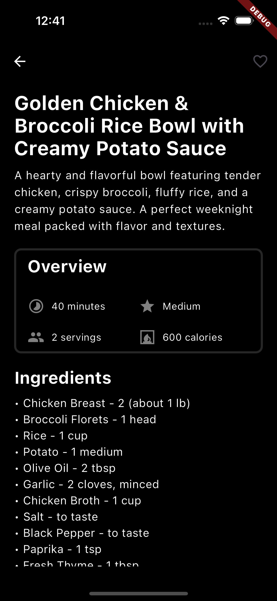

# chef_gpt

A Flutter project that generates Recipes using GEMINI AI

## Getting Started

This project is using i18n and some of then needs to be compiled before using. 
Run the:

`flutter pub run intl_utils:generate`

command to generate localization classes.

## Prompt Generator

 
 

## Recipe Result

